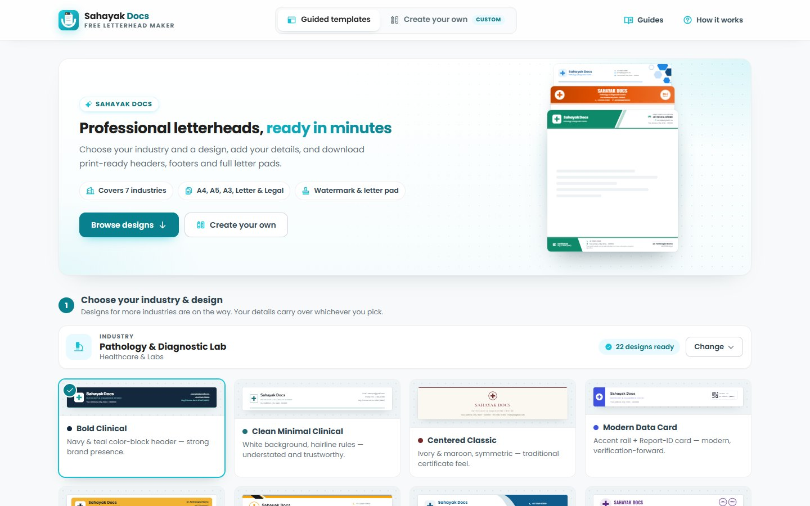
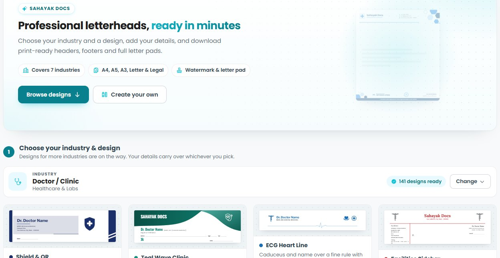
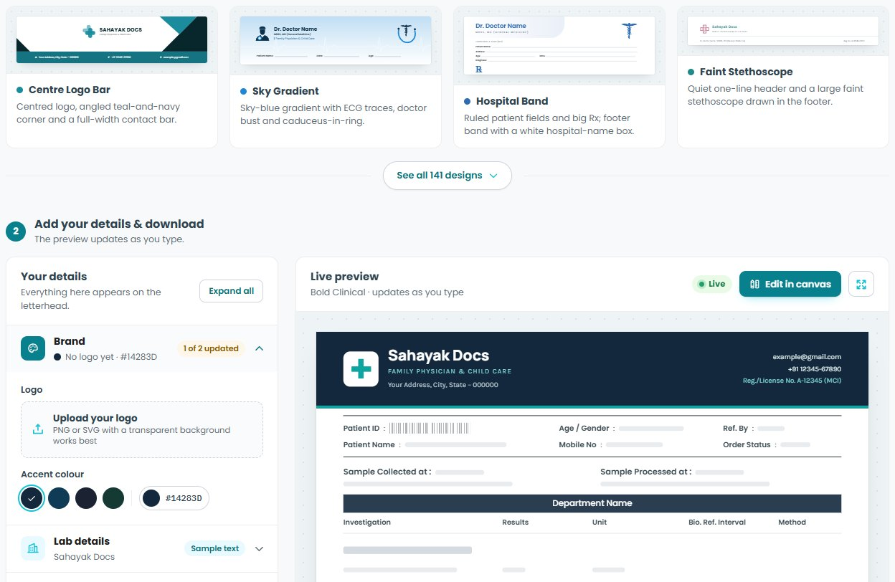
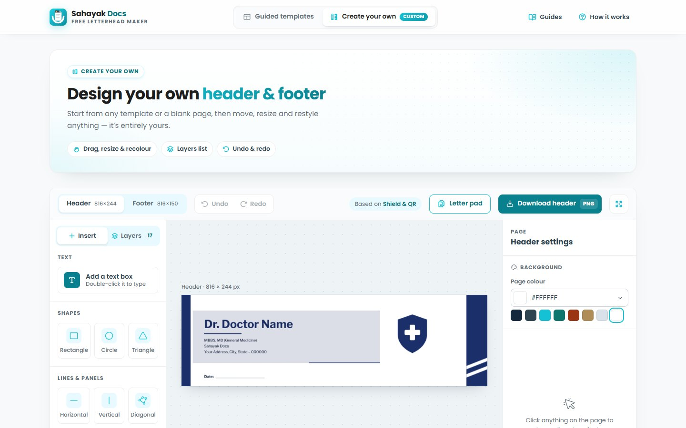
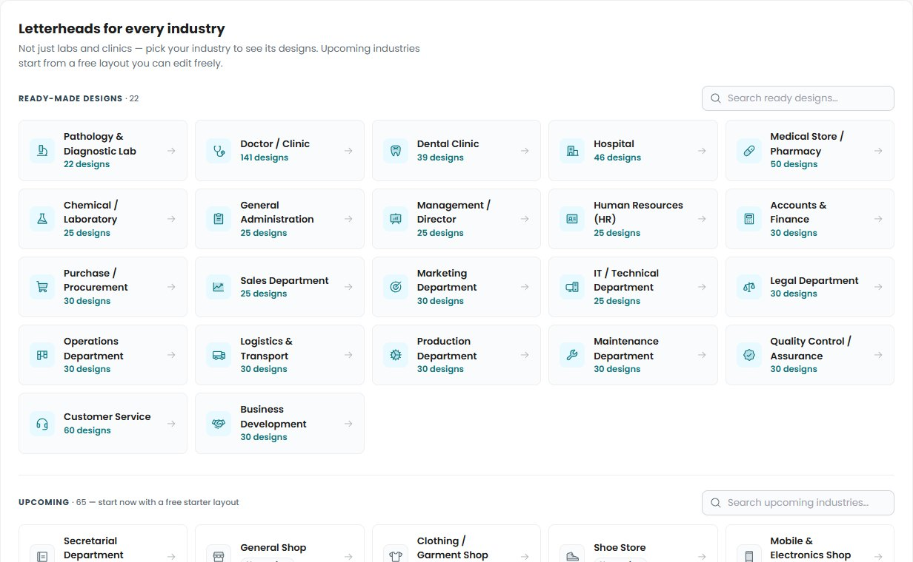

  

<h1 align="center">Sahayak Docs</h1>

  <b>Free letterhead &amp; letter pad maker — professional letterheads, ready in minutes</b> 
  Made in India 🇮🇳 for clinics, labs, pharmacies, hospitals, companies, shops, schools and NGOs

  

  
  
  
  
  
  
  

  

---

## ✨ What is Sahayak Docs?

**Sahayak Docs** ([sahayakdocs.com](https://sahayakdocs.com)) is a **free online letterhead and letter pad maker**.
Choose your industry, pick a ready-made design, type your details, and download a **print-ready letterhead
header, footer or full letter pad** as PDF or PNG. It all happens in your browser in a few minutes, with no design
skills and no software.

- 🎨 **800+ ready-made designs**, each made for a specific field
- ✏️ **Edit everything**: text, logo, colours, and every line and shape
- 🖨️ **Print-ready** at 3× resolution, as PDF or PNG
- 💯 **Free forever**: no sign-up, no watermark, no limits

> 💡 **Good to know:** Sahayak Docs is an independent letterhead and letter pad maker. It is **not** related to
> Doctor Sahayak, Health Sahayak, Jan Sahayak, eSahayak, HR Sahayak or other apps with "Sahayak" (Hindi for
> "helper") in the name.

---

## 👥 Who is it for?

| | You are… | You can make… |
|:-:|---|---|
| 🩺 | **Doctor / Clinic** | Doctor letterheads and **prescription pads** with qualification, registration number, timings and a ℞ area |
| 🏥 | **Hospital** | Hospital letterheads with departments, emergency number and registration details |
| 🔬 | **Pathology / Diagnostic Lab** | **Lab report letterheads** with NABL number and pathologist sign-off |
| 🦷 | **Dental Clinic** | Dental letterheads and prescription pads |
| 💊 | **Medical Store / Pharmacy** | Letterheads for bills and cash memos with drug licence and GSTIN |
| 🧪 | **Chemical / Testing Lab** | Letterheads for test reports and certificates |
| 🏢 | **Company / Office** | Company letterheads and **department letterheads**: HR, accounts, sales, IT, legal and more |
| 🏪 | **Shop, firm, factory, school or NGO** | A starter letterhead you can customise freely |

---

## 🚀 How it works: 4 easy steps

| Step | What you do |
|:-:|---|
| **1️⃣ Choose** | Pick your industry and a design you like |
| **2️⃣ Add details** | Logo, name, address, phone, email, registration number. The preview updates as you type |
| **3️⃣ Customise** *(optional)* | Open **Create your own** to move, resize, recolour or hide anything |
| **4️⃣ Download** | Full letter pad as **PDF / PNG**, or the header and footer as images |

### 🖼️ See it in action

**Home: start in one click**

**1️⃣ Choose your industry and a design** (for example, 141 designs for doctors and clinics)

**2️⃣ Add your details and watch the live preview**

**3️⃣ Customise anything in "Create your own"**

**🏭 Letterheads for every industry**

---

## 🌟 Features

<table>
<tr>
<td width="50%" valign="top">

### 🎨 Designs
- 800+ ready-made designs for 22 industries
- Starter designs for 65 more industries
- Right fields for each field: doctor's qualification, lab's NABL number, company CIN and GSTIN
- Any accent colour you like

</td>
<td width="50%" valign="top">

### ✏️ Editing
- Simple form with a **live full-page preview**
- Drag-and-drop **"Create your own"** editor
- Move, resize, rotate, recolour, hide
- Add text, lines, shapes and icons
- Layers, undo and redo, snapping guides

</td>
</tr>
<tr>
<td width="50%" valign="top">

### 📥 Downloads
- **Letter pad PDF**: one page or many
- **Header and footer PNG** for Word or Google Docs
- A4, A5, A3, Letter and Legal sizes
- Optional **watermark** with your logo or seal
- Print margins or edge to edge

</td>
<td width="50%" valign="top">

### 💚 Always
- 100% free, no sign-up
- No watermark from us
- Works on computer, tablet and phone
- Fast, and nothing to install

</td>
</tr>
</table>

---

## 🏷️ Ready-made designs by industry

| 🏥 Healthcare & Labs | Designs | 🏢 Company departments | Designs |
|---|:-:|---|:-:|
| 🩺 Doctor / Clinic | **141** | 🎧 Customer Service | **60** |
| 💊 Medical Store / Pharmacy | **50** | 🧮 Accounts & Finance | **30** |
| 🏥 Hospital | **46** | 🛒 Purchase / Procurement | **30** |
| 🦷 Dental Clinic | **39** | 🎯 Marketing | **30** |
| 🧪 Chemical / Laboratory | **25** | ⚖️ Legal | **30** |
| 🔬 Pathology & Diagnostic Lab | **22** | 📋 Operations | **30** |
| | | 🚚 Logistics & Transport | **30** |
| | | ⚙️ Production | **30** |
| | | 🔧 Maintenance | **30** |
| | | ✅ Quality Control | **30** |
| | | 🤝 Business Development | **30** |
| | | 🗂️ General Administration | **25** |
| | | 📊 Management / Director | **25** |
| | | 🪪 Human Resources (HR) | **25** |
| | | 📈 Sales | **25** |
| | | 💻 IT / Technical | **25** |

**🔜 Coming soon, with a starter design you can use today:** 🏪 shops and retail · 👔 professional services
(law firms, CA firms, architects, contractors, real estate) · 🏭 factories and manufacturing · 🎓 schools and
colleges · 🤲 NGOs · 🏛️ government offices · 🏋️ gyms and sports clubs · and letterheads by purpose (quotation,
invoice, HR…).

---

## 📄 Paper sizes and files

| 📏 Size | Dimensions | 👍 Best for |
|---|---|---|
| **A4** | 210 × 297 mm | Letters, reports, notices (standard in India) |
| **A5** | 148 × 210 mm | Prescription pads, small notes, receipts |
| **A3** | 297 × 420 mm | Large notices and charts |
| **Letter** | 8.5 × 11 in | US-size paper |
| **Legal** | 8.5 × 14 in | Long documents and agreements |

| 📁 File | ✅ What you get |
|---|---|
| **Letter pad PDF** | Full pages with your header and footer, ready to print |
| **Letter pad PNG** | A full page as an image |
| **Header PNG / Footer PNG** | High-resolution images for Word, Google Docs and more |

---

## 📝 Use it in Microsoft Word or Google Docs

1. ⬇️ Download the **Header PNG** and **Footer PNG**.
2. 📘 **Word:** Insert → Header → add the header image and stretch it to the page width. Do the same for the footer.
3. 📗 **Google Docs:** click in the header area and insert the image.
4. 💾 Save it as a template, so every new letter starts with your letterhead.

👉 [Step-by-step guide: using your letterhead in Word and Google Docs](https://sahayakdocs.com/guides/use-letterhead-in-word-google-docs/)

---

## 🔗 Popular pages

| 🛠️ Makers | 🩺 Healthcare | 🏢 Business |
|---|---|---|
| [Free letterhead maker](https://sahayakdocs.com/letterhead-maker/) | [Doctor letterhead & prescription pad](https://sahayakdocs.com/doctor-letterhead/) | [Company letterhead](https://sahayakdocs.com/company-letterhead/) |
| [Letter pad maker & design](https://sahayakdocs.com/letter-pad-maker/) | [Hospital letterhead](https://sahayakdocs.com/hospital-letterhead/) | [HR letterhead](https://sahayakdocs.com/hr-letterhead/) |
| [Edit letterhead online](https://sahayakdocs.com/edit-letterhead-online/) | [Pathology lab letterhead](https://sahayakdocs.com/pathology-lab-letterhead/) | [Quotation letterhead](https://sahayakdocs.com/quotation-letterhead/) |
| [Letterhead format](https://sahayakdocs.com/letterhead-format/) | [Dental clinic letterhead](https://sahayakdocs.com/dental-clinic-letterhead/) | [IT company letterhead](https://sahayakdocs.com/it-company-letterhead/) |
| [All guides](https://sahayakdocs.com/guides/) | [Medical store letterhead](https://sahayakdocs.com/medical-store-letterhead/) | [Accounts letterhead](https://sahayakdocs.com/accounts-letterhead/) |
| | [Chemical lab letterhead](https://sahayakdocs.com/chemical-lab-letterhead/) | [Legal letterhead](https://sahayakdocs.com/legal-letterhead/) |

**📚 Helpful guides:**
[How to make a professional letterhead](https://sahayakdocs.com/guides/how-to-make-a-letterhead/) ·
[Letterhead sizes explained](https://sahayakdocs.com/guides/letterhead-size-guide/) ·
[What to include on a letterhead in India](https://sahayakdocs.com/guides/what-to-include-on-a-letterhead/) ·
[Lab report letterhead guide](https://sahayakdocs.com/guides/lab-report-letterhead-guide/) ·
[10 letterhead design tips](https://sahayakdocs.com/guides/letterhead-design-tips/)

---

## ❓ Frequently asked questions

<b>What is Sahayak Docs?</b>

A free online letterhead and letter pad maker made in India, at [sahayakdocs.com](https://sahayakdocs.com). Pick a
design for your industry, add your details and download a print-ready letterhead or letter pad.

<b>Is it really free?</b>

Yes. Every design, the editor and every download are free, with no sign-up and no watermark. The site is supported
by advertising.

<b>Is it the same as Doctor Sahayak, Jan Sahayak or eSahayak?</b>

No. Sahayak Docs is an independent letterhead maker and is not connected to other products with "Sahayak" in the
name.

<b>Can I edit the whole design, not just the text?</b>

Yes. Open any design in **Create your own** to move, resize, recolour or hide any element, and add your own text,
lines and shapes.

<b>Can I add my logo?</b>

Yes. Upload a PNG or SVG logo; a transparent background works best.

<b>Can I make a doctor's prescription pad?</b>

Yes. Doctor and dental designs work as prescription pads. Download them in A5 or A4.

<b>Do I need to install anything?</b>

No. It works in any modern browser on a computer, tablet or phone.

---

## 🔒 Privacy

- ✅ No account needed, and your letterhead details stay in your browser. They're not stored on a server.
- 📊 Visits are counted with Google Analytics (never what you type), and the site shows ads.
- 📜 Full policy: [sahayakdocs.com/privacy](https://sahayakdocs.com/privacy/)

---

  

  <b>Sahayak Docs</b> — free letterhead &amp; letter pad maker · Made in India 🇮🇳 
  <a href="https://sahayakdocs.com">sahayakdocs.com</a> · <a href="https://sahayakdocs.com/contact/">Contact</a>

